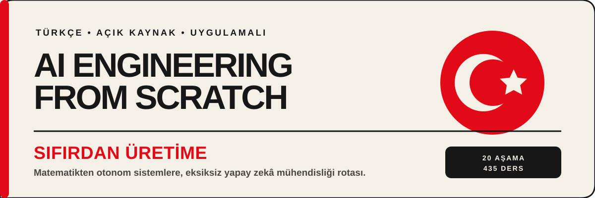

<p align="center">
  
</p>

# AI Engineering from Scratch — Türkçe

> Yapay zekâ mühendisliğini matematik temellerinden üretim sistemlerine kadar,
> Türkçe anlatımlar ve çalışan uygulamalarla adım adım öğrenin.

Bu depo, **AI Engineering from Scratch** eğitim programının hafif, yalnızca
Türkçe dağıtımıdır. İngilizce anlatımlar ve çeviri geliştirme dosyaları yerine
öğrenmek ve uygulamak için gereken dersleri, kodu, testleri, quizleri ve
yeniden kullanılabilir çıktıları içerir.

**20 aşama** · **503 Türkçe ders** · **%100 Türkçe anlatım kapsamı**

**Kaynak revizyon:** `874f2f0f0b347e527949085c5f497b3c3f4537e3`

## Bu müfredat kimin için?

Yapay zekâ mühendisliğine sağlam bir temel kurarak başlamak, bildiklerini
derinleştirmek veya üretime hazır sistemler geliştirmek isteyen herkes için
tasarlanmıştır. Konular matematik ve programlama temellerinden başlayıp
LLM'ler, agent sistemleri, altyapı, güvenlik ve bitirme projelerine ilerler.

Başlamadan önce yalnızca temel terminal kullanımı ve öğrenmeye istekli olmanız
yeterlidir. Python deneyimi faydalıdır ancak zorunlu değildir; gerekli araçlar
ve ortam kurulumu ilk aşamada adım adım ele alınır.

## Hızlı başlangıç

### 1. Depoyu bilgisayarınıza alın

Terminali açın ve depoyu klonlayın:

```bash
git clone https://github.com/ademiru/ai-engineering-from-scratch-tr.git
```

> **Git kullanmıyor musunuz?** En güncel `.tar.gz` arşivini indirin ve
> `ai-engineering-from-scratch-tr` adlı bir klasöre çıkarın.

### 2. Depo klasörüne girin

Klonlama veya arşivi çıkarma işlemi bitince terminalde şu komutu çalıştırın:

```bash
cd ai-engineering-from-scratch-tr
```

### 3. Yerel siteyi başlatın

Artık depo klasöründesiniz. Kurulum yapmadan yerel siteyi çalıştırın:

```bash
python3 -m http.server 8000
```

> Sunucu çalışırken bu terminal penceresini açık bırakın. Windows'ta
> `python3` bulunamazsa `python -m http.server 8000` komutunu deneyin.

### 4. Tarayıcıda açın

Tarayıcınızda **[http://localhost:8000](http://localhost:8000)** adresine
gidin. Karşınıza aşamaları ve dersleri gezebileceğiniz Türkçe müfredat
vitrini çıkar. Bitirdiğinizde terminale dönüp `Ctrl+C` ile siteyi kapatın.

### 5. İlk aşamayı açın

[Aşama 0: Kurulum ve Araçlar](phases/00-setup-and-tooling/README.md) sayfasına gidin ve ilk dersi
seçin.

### 6. İlk dersi tamamlayın

Her dersin Türkçe anlatımı `docs/tr.md` dosyasındadır. Uygulamalar ve testler
aynı dersin `code/` dizininde yer alır; çalıştırma komutları ders içinde
belirtilir. Önce anlatımı okuyun, sonra örneği çalıştırın ve quiz ile
öğrendiklerinizi kontrol edin.

## Size uygun rota

| Seviyeniz | Önerilen başlangıç | Nasıl ilerlemelisiniz? |
|---|---|---|
| Yeni başlıyorum | [Aşama 0: Kurulum ve Araçlar](phases/00-setup-and-tooling/README.md) | Aşamaları sırayla tamamlayın. |
| Temelleri biliyorum | Aşağıdaki öğrenme rotası | Eksik olduğunuz aşamadan başlayın; önkoşulları kontrol edin. |
| Proje geliştirmek istiyorum | Aşama 19: Bitirme Projeleri | İlgili projenin gerektirdiği önceki aşamalara geri dönün. |

> **Öneri:** Hız yerine sürekliliği hedefleyin. Her derste kodu çalıştırmak,
> yalnızca metni okumaktan daha kalıcı bir öğrenme sağlar.

## Öğrenme rotası

- **[Aşama 0: Kurulum ve Araçlar](phases/00-setup-and-tooling/README.md)** — 12 ders
- **[Aşama 1: Matematiğin Temelleri](phases/01-math-foundations/README.md)** — 22 ders
- **[Aşama 2: Makine Öğreniminin Temelleri](phases/02-ml-fundamentals/README.md)** — 18 ders
- **[Aşama 3: Deep Learning Çekirdek](phases/03-deep-learning-core/README.md)** — 13 ders
- **[Aşama 4: Bilgisayarla Görme](phases/04-computer-vision/README.md)** — 28 ders
- **[Aşama 5: NLP — İleri Düzeyin Temelleri](phases/05-nlp-foundations-to-advanced/README.md)** — 29 ders
- **[Aşama 6: Konuşma ve Ses](phases/06-speech-and-audio/README.md)** — 17 ders
- **[Aşama 7: Transformer'ları Derinlemesine İnceleme](phases/07-transformers-deep-dive/README.md)** — 16 ders
- **[Aşama 8: Üretken Yapay Zeka](phases/08-generative-ai/README.md)** — 15 ders
- **[Aşama 9: Takviyeli Öğrenme](phases/09-reinforcement-learning/README.md)** — 12 ders
- **[Aşama 10: Sıfırdan Yüksek Lisans](phases/10-llms-from-scratch/README.md)** — 24 ders
- **[Aşama 11: Yüksek Lisans Mühendisliği](phases/11-llm-engineering/README.md)** — 17 ders
- **[Aşama 12: Çok Modlu Yapay Zeka](phases/12-multimodal-ai/README.md)** — 25 ders
- **[Aşama 13: Araçlar ve Protokoller](phases/13-tools-and-protocols/README.md)** — 23 ders
- **[Aşama 14: Agent Mühendislik](phases/14-agent-engineering/README.md)** — 42 ders
- **[Aşama 15: Otonom Sistemler](phases/15-autonomous-systems/README.md)** — 22 ders
- **[Aşama 16: Çoklu Agent ve Sürüler](phases/16-multi-agent-and-swarms/README.md)** — 25 ders
- **[Aşama 17: Altyapı ve Üretim](phases/17-infrastructure-and-production/README.md)** — 28 ders
- **[Aşama 18: Etik, Güvenlik ve Uyum](phases/18-ethics-safety-alignment/README.md)** — 30 ders
- **[Aşama 19: Bitirme Projeleri](phases/19-capstone-projects/README.md)** — 85 ders

Aşamaları sırayla izleyebilir veya ihtiyacınız olan konuya doğrudan
geçebilirsiniz. Bir aşama sayfası, o aşamadaki tüm Türkçe derslere bağlantı
verir.

## Bir ders nasıl çalışılır?

1. Aşama sayfasından bir ders seçin ve `docs/tr.md` anlatımını okuyun.
2. Kavramı hazır bir çerçeveye bırakmadan önce temel mantığı kendiniz kurun.
3. `code/` altındaki örneği çalıştırın ve testleri inceleyin.
4. `quiz.json` ile bilginizi sınayın.
5. Varsa `outputs/` altındaki çıktıyı kendi projenizde yeniden kullanın.

## Depoda neler var?

| Yol | İçerik |
|---|---|
| `phases/` | Aşamalar, Türkçe dersler ve uygulamalar |
| `docs/tr.md` | Dersin Türkçe anlatımı |
| `code/` | Çalıştırılabilir örnekler ve testler |
| `quiz.json` | Ders değerlendirme soruları |
| `outputs/` | Yeniden kullanılabilir beceri, prompt ve araçlar |
| `MANIFEST.json` | Kapsam, kaynak revizyonu ve doğrulama sonucu |

## Dağıtım güvenceleri

Her sürüm otomatik olarak üretilir ve yayımlanmadan önce Türkçe ders kapsamı,
yerel Markdown bağlantıları ve hariç tutulması gereken dosyalar doğrulanır.
`MANIFEST.json`, bu kontrollerin sonucunu ve dağıtımın kaynak revizyonunu
makine tarafından okunabilir biçimde kaydeder.

Bu depo ana eğitim programından türetilir. Güncelleme ve yeniden üretim süreci
[SENKRONIZASYON.md](SENKRONIZASYON.md) belgesinde açıklanır.

## Kaynak ve atıf

Bu Türkçe dağıtım, Rohit Ghumare tarafından yayımlanan
[AI Engineering from Scratch](https://github.com/rohitg00/ai-engineering-from-scratch)
projesinden türetilmiştir. Türkçe çeviri ve dağıtım düzenlemeleri özgün çalışmayı
temel alır; kaynak revizyon yukarıda ve `MANIFEST.json` içinde kayıtlıdır.

## Katkı ve geri bildirim

Bir anlatım hatası, kırık bağlantı veya çalışmayan örnek bulursanız kaynak
depoda issue açın. Ders düzeltmeleri önce kaynak Türkçe içeriğe uygulanır,
ardından bu hafif dağıtım yeniden üretilir.

## Sık sorulan sorular

### Tüm aşamaları sırayla bitirmem gerekir mi?

Yeni başlıyorsanız evet. Deneyimliyseniz hedefinize uygun aşamadan başlayabilir,
anlamadığınız bir önkoşul olduğunda önceki aşamalara dönebilirsiniz.

### Ücretli bir araç veya API gerekiyor mu?

Müfredatı okumak için hayır. Bazı ileri uygulamalar harici bir servis veya API
anahtarı kullanabilir; ilgili ders gerekli koşulları ve alternatifleri açıklar.

### İçerik neden yalnızca Türkçe?

Bu depo hızlı indirme ve odaklı kullanım için hazırlanmış Türkçe dağıtımdır.
İngilizce içerik ve çeviri geliştirme varlıkları bilinçli olarak dışarıda
bırakılmıştır.

## Lisans

Bu dağıtım [MIT Lisansı](LICENSE) altındadır. Dağıtıma özgün projenin eksiksiz
lisans metni, `Copyright (c) 2026 Rohit Ghumare` telif bildirimiyle birlikte
dahil edilmiştir. Kullanım ve yeniden dağıtımda bu bildirim ile izin metni
korunmalıdır.
